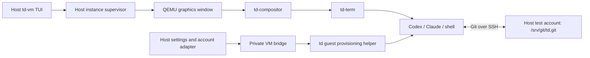
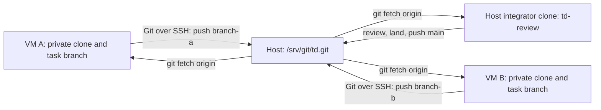

# td-vm: graphical development instances

## Status and scope

The main acceptance criterion is **create an instance, open its QEMU window,
and start working in td with the selected agent and existing host identity**.
Installing compilers, cloning the repository, configuring terminals, and
logging in separately on every image are not user setup steps.

The host is Linux x86-64 with a graphical session. KVM is preferred; QEMU TCG
software emulation is a supported fallback. The fallback changes performance,
not which td image boots or which development features are available.

## The daily flow

Running `td-vm` opens a table in the host terminal, using td-review's compact
keyboard-driven interaction style. Each row shows instance name, selected
repository/branch, template revision, VM state, accelerator, CPU/RAM allocation,
disk usage, and agent readiness. Details and failures appear below the table.
Escape sequences in names, guest messages, and logs are rendered as text.

| Action | Behavior |
| --- | --- |
| New | Choose name and Codex, Claude, or a development shell; use the configured repository, template, and resource defaults. |
| Open / Enter | Boot a stopped instance in its own QEMU graphics window. For a running instance, identify its existing window and focus it where the host permits; never launch a second QEMU on its disk. |
| Stop | Request an orderly guest shutdown and report completion. |
| Restart | Request an orderly guest reboot within the same QEMU process. |
| Delete | Show the exact instance and its persistent data, then remove it only when stopped. |
| Templates | Prepare/import a verified template, select the default, inspect references, or remove an unused template. |
| Host integration | Show settings compatibility and account-link status; synchronize settings or reconnect an expired account. |
| Logs | Inspect bounded boot/provisioning diagnostics without exposing credentials. |
| Quit | Close the manager; leave running QEMU windows and their supervisors alive. |

Equivalent noninteractive subcommands use the same operations. Instance creation
does not ask for an SSH identity, port, terminal emulator, or tmux session.



The guest owns terminal rendering, scrollback, input, and application launch.
td-vm does not relay terminal bytes or implement terminal multiplexing.

## QEMU and window lifetime

Use a native QEMU GTK or SDL window with td's canonical virtual GPU, input,
audio, boot kernel, selector, and deployment layout. Keep the display backend
in the host profile; its absence is a specific host dependency error, not a
reason to open a serial shell instead. Window titles include the instance name.

Automatic acceleration tries KVM, including its actual initialization, then
TCG if acceleration is unavailable. Use a CPU model supported by both modes
and sufficient for the image's compiled CPU baseline; `-cpu host` cannot be
carried blindly into TCG. Record the accelerator actually selected through
QMP. The table says `Software (TCG)` when appropriate. An explicit `--accel
tcg` is available for reproducible fallback tests; `--accel kvm` requests a
strict diagnostic instead of fallback. Disk, display, and boot errors are
reported as themselves, not retried as presumed KVM failures.

Closing the host TUI is independent of the VM. Native QEMU windows are not
detachable viewers: minimizing a window keeps it running. Configure
`window-close=off` on the supported GTK/SDL backends so the window-manager
close button cannot accidentally cut power; use Stop or the guest's shutdown
action. QEMU crashes or an explicit force-stop are unclean exits. Report them,
retain the disk, and let the next boot perform normal filesystem recovery.
No promise is made to reconstruct a live QEMU display after its process dies.
QEMU documents accelerator fallback and these display controls in its
[invocation reference](https://www.qemu.org/docs/master/system/invocation.html).

One small supervisor per running instance owns QEMU, QMP, and its guest bridge.
It survives TUI exit and has a private reconnectable control socket. Restarting
the TUI discovers these supervisors; it does not infer ownership from a process
name. A supervisor failure must not start a replacement guest until the
existing QEMU and disk lock are accounted for. Request orderly power actions
through the guest helper, which invokes td-svc's existing fixed power
operations. Force-stop is a distinct destructive action through QMP.

## Templates and isolated persistent state

A reusable template contains a verified td development deployment, not a
previous developer's machine. Build it locally from pinned recipes once and
reuse it. No maintainer-operated image server or binary cache is introduced.
Cold template preparation may require the full bootstrap build; show that as
template preparation, never hide it inside every New operation.

Import verifies the consumed kernel, selector, disk, and development manifest
against checksums and the deployment's existing trust chain. The manifest
records source revision, CLI versions, guest protocol version, and development
capabilities. Reject external qcow2 backing/data dependencies. Copy imported
bytes into manager-owned storage before publishing an immutable template.

Each instance has an independent qcow2 overlay, machine identity, home,
repository clone, Git metadata, build outputs, store/cache writes, runtime
sockets, and agent session history. Template identities and credentials must
be absent. Do not turn a used instance into a template by merely deleting a
few visible files: old disk extents can retain them. Template production starts
from clean recipe outputs and fresh state.

The disk manager must provide per-instance locks,
short catalog transactions, immutable referenced bases, atomic publication,
recoverable staging, read-only status queries, and refusal to delete a live
disk. Base preparation must not hold a global lock while compiling. Removing
one instance must not touch another instance or any host CLI home. Report both
virtual disk capacity and actual allocated space; refuse an allocation that
cannot satisfy the configured reserve. CPU, RAM, and storage bandwidth remain
host-wide finite resources even though build locks are isolated.

## A development image, not a demo needing setup

The image producer owns these requirements:

- Source-built Rust, Cargo, linker/compiler tools, td control-plane tools,
  Git, the source-built OpenSSH client and key generator, required build/test
  utilities, CA certificates, and declared offline dependency sources.
  A clean checkout must build its builder and run the
  repository's actual checks with no host executables entering the target.
- A private writable build store and caches backed by the instance disk.
  Keep the deployed root immutable. Use the builder's declared store-prefix
  and sandbox mechanisms; never redirect writes into the template or pretend
  that the deployed read-only `/td/store` is a writable build workspace.
  The image increment must pin and test the exact prefix/mount arrangement.
- td-compositor, td-term, matching terminfo, and an ordinary development-user
  session. The provisioner creates state through its fixed service operation;
  the UI must not depend on the current root/su escape hatch.
- Source-built Codex and the reviewed Claude application payload and runtime,
  with their working directories, configuration, credentials, and child tools
  reachable through their proper launch paths. Host CLI executables and host
  plugin binaries are not copied into the image.
- The tools required by DEVELOPMENT.md's review roster as well as its build
  gate. An unavailable reviewer remains an explicit missing capability; the
  design does not make reviewer waivers or host-side execution of guest builds
  the default workflow.

First boot creates a unique identity, provisions the private Git clone and
task worktree described below, installs the mapped settings, establishes the
selected account adapter, and opens the chosen agent in a fresh td-term window
at that worktree. Provisioning is idempotent and journaled by generation:
retries do not erase work, rerun a clone over a modified checkout, or reset CLI state.
Subsequent boots reuse that state and report any required migration.

Distinguish `Booting`, `Preparing workspace`, `Needs host attention`, and
`Ready`. A successful QEMU spawn or a visible desktop alone is not Ready.
In particular, toolchain checks and a provider-authentication probe must pass
before displaying an agent as ready. Probes do not submit prompts or paid
model requests merely to check login.

## Sharing settings without sharing mutable homes

Link each selected host CLI profile once. Honor its configured home/location
and credential backend rather than assuming every installation uses defaults.
Settings transfer is an explicit schema/version adapter, not a recursive mount
of `~/.codex`, `~/.claude`, or the host home.

Copy portable preferences, instructions, skills, and supported source-based
extensions into an instance-local configuration generation. Map the chosen host
repository path to the guest's active task worktree. Reconstruct host-specific
paths instead of leaving references to `/home/test` or `/gnu/store` in guest configuration.
Preserve provider, organization, model, and permission intent. Do not silently
weaken sandbox settings, switch accounts, or replace subscription auth with a
billed API key.

Hooks, MCP commands, credential helpers, local sockets, and binary plugins need
an explicit supported guest mapping. Classify secret-bearing settings as
credentials even if they occur in TOML/JSON. Show unsupported entries and their
effect once in Host integration; required entries with no mapping prevent the
profile being called compatible. Never run a guest-supplied hook on the host.
The manager supplies no general host-command proxy.

Locks, databases, session transcripts, caches, and project trust records remain
private. New instances receive the selected settings generation automatically.
Synchronize settings explicitly for an existing instance, showing conflicts
with guest edits. Boot does not overwrite its changed settings, and guest
changes are not silently written back to the host profile.

## Login reuse and refresh ownership

The desired UX is automatic reuse of an already linked host identity for each
new VM. Credential linking is host-level setup, not image setup. An expired or
unsupported login produces one actionable host status with a supported renewal
flow; asking every guest to start its own browser login is not the solution.

**Do not clone refresh-token caches into concurrently running VMs.** Codex
supports a file cache under CODEX_HOME or an OS credential store, and documents
copying a cache to a remote machine. Its concurrent-use constraint matters:
the automation guidance restricts a refreshable cache to one machine or
serialized stream and warns that another consumer's rotation can invalidate
it. Copying the bytes into separate files does not remove that upstream race.
See [Codex authentication](https://developers.openai.com/codex/auth/) and
[refresh ownership](https://developers.openai.com/codex/auth/ci-cd-auth/).

The design therefore uses a host account adapter as the single refresh owner
and delivers only the provider material each guest actually needs. Guest
sessions, tool execution, and model traffic remain in td. This is a user-local
credential service tied to the managed VMs, not maintainer-run infrastructure
or an inference proxy. An adapter must coordinate with any continuing native
host CLI consumer through a verified provider mechanism. A td-vm-only file
lock does not coordinate an unrelated host CLI. If exclusive ownership cannot
be established, link a distinct managed host credential once rather than
claiming the existing cache is safe to fan out.

Provider integration has separate obligations:

| Provider/mode | Design and required proof |
| --- | --- |
| Codex subscription | Keep refresh ownership on the host; deliver account-bound access credentials to guest Codex through a supported external-auth path. Codex app-server documents an experimental external-token mode, but that does not establish support in the shipped interactive CLI. Prove that CLI path, or add a reviewed source-built adapter, before claiming this mode works. |
| Claude subscription | Prefer a reusable host-managed credential that the pinned CLI officially accepts. A `claude setup-token` credential is a candidate for one-time host linking; an ordinary cached access token is not equivalent to it. Prove expiry, restart/resume, account restrictions, and the guest launch interface. |
| Existing API-key profile | Deliver the selected existing key through the provider adapter, retaining the configured endpoint and billing mode. Never select this mode just because subscription forwarding is unfinished. |
| OS keyring or external helper | Use a reviewed host adapter for that backend. Never copy the keyring database, request all stored secrets, or assume a nonexportable credential can be extracted. |

Codex's [external-auth documentation](https://developers.openai.com/codex/app-server/)
is an integration lead, not evidence that a transparent CLI bridge exists.
Claude documents Linux credentials in its configured `.credentials.json` and
a separately generated setup token. Its environment-token mode retains the
token for the running session and requires replacement/restart on expiry;
rewriting a file cannot be assumed to update that process. See
[Claude authentication](https://code.claude.com/docs/en/authentication) and
[environment variables](https://code.claude.com/docs/en/env-vars).

This provider-compatibility spike is the first implementation step. Its output
must name the exact host/guest versions, supported login modes, refresh owner,
and behavior under concurrent use. Unsupported modes remain visibly incomplete.
Do not declare effortless login solved by startup-only copy tests or invent an
OAuth exchange unsupported by the provider. One-time host authorization may
still be necessary for a managed credential; no per-image repetition is planned.

## The host/guest bridge

Use a dedicated virtio-serial port per VM connected to its supervisor through
a private Unix socket. QMP is a separate host-only control socket. The bridge
handles provisioning, agent credentials, status, and power operations. Git uses
ordinary outbound SSH to the host; neither an SSH daemon in the guest nor a
host-to-guest port-forward is required. Interactive sessions use the QEMU
window, with no shared writable filesystem or tmux.

The host binds identity to the socket/QEMU pair it launched, not to an instance
name supplied by the guest. A versioned, bounded protocol carries fixed requests
for provisioning/status, selected settings generations, selected provider
credentials, Git public-key enrollment/branch reservations, and power operations.
Git objects and pack-protocol streams never travel over this bridge. The
protocol increment must specify framing, lengths, deadlines, backpressure,
generation checks, and reconnect behavior before exposing a parser.

On the guest, a fixed-purpose td-owned service provisions files and publishes
user/application-scoped endpoints. Credentials reach the intended CLI through
its declared launch/credential interface, using volatile storage or descriptors
where supported. A file backend requiring persistence needs an explicit
per-instance credential-storage decision. No credentials belong in a template,
repo, seed manifest, QEMU argv, serial log, or TUI output. Do not send them via
synthetic keystrokes or the clipboard. A required environment variable is set
only at the final CLI launch boundary, not on QEMU or the whole desktop.

A running guest receiving a bearer credential can use that identity. VM
isolation does not confine the provider account or protect it from guest root.
Unlink/delete stops further deliveries; it cannot revoke already issued bytes.
Provider revocation remains distinct, and disk deletion is not secure erasure.
This design grants no new claim of hardware sealing, attestation, or human
authentication; [td-login's threat model](../td-login/THREAT-MODEL.md) and
[td-secret's contract](../td-secret/DESIGN.md) retain their existing scope.

## Git: guest clone, host origin, and td-review

### One shared bare origin, independent working copies

The host's existing bare repository is the submission point. For this repo,
the host profile selects `ssh://test@td-host/srv/git/td.git` as the guest's
origin URL. `td-host` is a provisioned SSH alias for the reachable host address
and port, not a required public DNS name. Both VM pushes and the integrator's
fetches reach the existing `/srv/git/td.git` bare repository. There is no second
per-VM remote that someone must export, synchronize, or discover before review.
The URL and its corresponding local repository are configured once on the host
and validated as an accessible bare Git repository with `main` as its default
branch. Opening td-vm from a host checkout can discover this local origin,
but must not silently create or
replace a repository when the configured origin is absent or inaccessible.

| Location | Repository and purpose |
| --- | --- |
| Host `/srv/git/td.git` | Shared bare origin: `refs/heads/main` and submitted topic branches. No working tree. |
| Each guest `/home/tester/src/td` | Full private clone, with `origin` addressing the host as `test` over SSH. |
| Each guest `/home/tester/src/work/<branch>` | Private task worktree on a descriptive branch, where the agent runs. |
| Host integrator checkout | Separate ordinary clone whose `origin` is `/srv/git/td.git`; td-review fetches and reviews its remote-tracking branches. |



Only Git objects and ref transactions cross the SSH connection. A guest does
not mount the bare repository, host checkout, or another guest's `.git` directory. Locks,
working-tree indexes, build caches, and check-host state stay within each VM.
The shared origin still takes Git's ordinary brief ref locks during pushes.

### Host accounts and authorized keys

`timmy` is the host operator running td-vm. `test` is the existing host account
used for Git SSH connections and access to `/srv/git/td.git`. Reuse that
account's repository ACLs; create no additional `git` account and do not
recursively change repository ownership. Check that files written through
SSH as `test` remain accessible to the integrator under the existing group/ACL
and umask policy. `timmy`'s local manager permissions and a VM's SSH permission
to act as `test` are different grants.
Codex/Claude settings and login reuse still come from `timmy`'s selected host
profiles. Selecting `test` for Git does not select `test`'s AI accounts.

The default authorized-key location is **`~test/.ssh/authorized_keys`**
(normally `/home/test/.ssh/authorized_keys`). It remains owned and managed
under `test`'s authority. Keep existing human/automation key entries unchanged;
only td-vm's registered VM entries carry the restrictions below. Do not apply
an account-wide forced command, disable `test`'s ordinary logins, or replace
its existing SSH configuration to implement this feature.

Each VM generates its own Ed25519 Git key on first boot. Its private half
stays in that instance's private persistent user state, mode 0600. Firstboot
sends only its public key through the instance-bound provisioning channel.
The host enrolls it for `test` and acknowledges enrollment before cloning.
Templates contain no Git private keys. Do not copy `timmy`'s or `test`'s personal
private key, or forward either user's SSH agent into guests.

Automated enrollment is a narrow host operation, not permission for `timmy`
or the guest to edit arbitrary files in `test`'s home. A local registrar runs
as `test`, accepts requests from the configured operator UID (`timmy`) over
an authenticated Unix socket, and manages only its own key records and branch
reservations. The manager associates guest public-key requests with its own
instance identity. The registrar accepts a validated public key and opaque
instance id, constructs the restrictions itself, and journals updates to its
records and authorized_keys while preserving unrelated entries. Publish each
file atomically; enable a key only when both records agree, and recover an
interrupted update without widening access. Reject
unexpected file metadata and conflicting edits rather than overwriting them.
Never accept caller-supplied authorized_keys options or a destination path.

One-time host integration installs/enables that registrar and establishes
`timmy`'s socket access under `test`'s authority. Existing ACLs may already
provide the necessary repository access; they do not automatically authorize
editing `test`'s SSH keys. This setup must complete before the profile is Ready,
so creating later instances needs neither per-VM sudo nor hand-edited keys.
The registrar and Git dispatcher are dependency-free host code; the registrar
is not a network service or a general command runner.

Each VM key receives OpenSSH's `restrict` option plus a fixed forced command
naming a trusted Git dispatcher and the registrar-assigned instance identity.
`restrict` disables PTYs, forwarding, and user rc execution; the forced command
restricts execution itself. The dispatcher validates SSH_ORIGINAL_COMMAND as
an allowed Git operation on this exact repository and invokes Git with fixed
argv and a sanitized environment. It never evaluates the supplied command
through a shell. Arbitrary commands, alternate paths, and SFTP are refused.
The identity comes from the authorized key's forced command, not a key comment
or client-supplied environment. See the
[OpenSSH authorized-key contract](https://man.openbsd.org/sshd.8).

Firstboot also installs the host's verified public host key in the guest's
known_hosts and an SSH profile selecting the instance key, `IdentitiesOnly`,
strict host-key checking, and no agent forwarding. Obtain that host key through
the trusted host setup/provisioning path, not an unauthenticated first network
connection. A host-key change requires updating the trusted profile. The SSH
address must work from QEMU's configured network; a LAN address can serve other
machines too. No inbound guest SSH listener is part of this arrangement.

Deleting or revoking an instance removes its enrolled key and stops accepting
new Git sessions. Track active sessions by registrar identity so explicit
revocation can terminate that instance's sessions too; removing a key alone
is not termination of an already authenticated connection. Posted Git branches
remain in the bare origin. Stopping and later booting a VM retains its key.

### First boot creates the clone automatically

The development image uses ordinary Git and its source-built OpenSSH client.
After key enrollment and host-key provisioning, the selected origin is ready
for an ordinary SSH clone. No custom Git remote helper is required.

On New, the manager selects a starting branch, normally `main`, records its
commit id, and reserves a unique descriptive task branch. The instance name
is the suggested branch name; the example below uses `terminal-scroll-fix`.
Use the normal branch naming rules in DEVELOPMENT.md, including reserving
`-rolling` for explicitly long-lived workstreams. The host retains the selected
commit for the duration of provisioning so concurrent origin updates or GC
cannot remove the source while the guest clones it.

Firstboot performs the equivalent of the following inside the guest. These
commands illustrate the provisioner's fixed argv operations, not manual setup
or a generated shell script:

```text
git clone --no-checkout --origin origin ssh://test@td-host/srv/git/td.git /home/tester/src/td
git -C /home/tester/src/td fetch origin
git -C /home/tester/src/td worktree add -b terminal-scroll-fix /home/tester/src/work/terminal-scroll-fix <selected-commit-id>
```

The clone contains the full history needed for merge-base, review, and rebase;
it is not shallow and uses no host object alternates or shared hardlinks.
Ensure `origin` has the normal fetch mapping
`+refs/heads/*:refs/remotes/origin/*` and set `origin/HEAD` to `origin/main`.
Verify the selected commit is present, retrieving its retained ref if origin
moved during provisioning. Record the resolved commit rather than checking out
whatever `main` happens to name later. Set the mapped Git author name/email and
open td-term at the task worktree. This completes before workspace readiness.

Clone directly over SSH. There is no separate initial-bundle transport or
bundle-backed `origin` to replace later. The image itself contains
no repository snapshot. Uncommitted host work is not cloned; show that exclusion
when selecting a source checkout. Continuing an existing host topic requires
its committed revision to be available in the configured origin and explicit
branch ownership transfer, rather than two active writers sharing a branch.

Retries use a private staging clone and publish it only after validation. A
failed clone can restart without replacing an existing workspace. Later boots
reuse the clone and worktree; they never reclone, reset, or silently rebase work.

### Normal guest Git commands reach the host

Git invokes SSH to connect as `test`; sshd authenticates the VM key and
executes its forced Git dispatcher. The dispatcher invokes only
`git-upload-pack` for clone/fetch or `git-receive-pack` for push against the
configured bare repository. SSH carries the standard full-duplex Git protocol.
Git retains responsibility for object transfer, negotiation, connectivity
checks, and ref updates. The local VM bridge is not on this data path.

The host-owned receive policy binds the authenticated instance identity to its
reserved branches, refusing updates to `main`, tags, other VMs' branches, and
internal retention refs. A trusted pre-receive check validates proposed ref
transactions before accepting a VM push; an SSH forced command alone does not
restrict branch updates. The dispatcher supplies that identity under host
control, and the guest cannot substitute environment or Git configuration to
bypass the policy. Preserve existing trusted repository hooks when integrating
this check. See [Git receive hooks](https://git-scm.com/docs/githooks).

A guest can read submitted topic branches for dependent work. Reserving
additional task branches is an atomic registrar operation that rejects
ownership conflicts. Guest push deletion is refused; branch cleanup remains
the integrator's job. Ordinary host access to the origin and the integrator's
separate credentials retain their existing authority to update main.

From the task worktree, the agent follows DEVELOPMENT.md: commit with the
required review record, run the real ready gate, then submit its branch:

```text
git fetch origin
target/release/td-builder ready
git push -u origin terminal-scroll-fix
```

A successful push creates or updates
`/srv/git/td.git`'s `refs/heads/terminal-scroll-fix`, preserving the exact commit
objects and review trailers. `origin` is the live host remote from the first
clone onward. There is no host-side file-copy or export step after a push.
An interrupted push is reconciled by fetching and comparing the remote tip;
do not infer rejection or success solely from a disconnected client.

Normal non-fast-forward conflicts require fetch and reconciliation. The
`--force-with-lease` workflow for rebased branches remains governed by
DEVELOPMENT.md and must be supported by the transport; the receive policy still
restricts which branch the VM can update. A push is not proof that guest tests
ran: ready and the durable review record remain the submission contract, and
the integrator performs its existing verification.

### Host review and the return path

The integrator uses its ordinary host checkout, already configured with this
bare origin. For a newly created integrator checkout, the one-time setup is
`git clone /srv/git/td.git /path/to/integrator`. Thereafter:

```text
git -C /path/to/integrator fetch --prune origin
td-review -C /path/to/integrator
```

Alternatively, `f` inside td-review fetches its base remote and refreshes the
table. The submitted branch appears as `origin/terminal-scroll-fix` under
`refs/remotes/origin/terminal-scroll-fix`; td-review reads the same commits and
review trailers the agent pushed. Its existing `r` replay and `p` publication
flow lands the work onto `main` and pushes it back to `/srv/git/td.git`. No
VM-specific discovery API, review inbox, namespace translation, or td-review
change is required. The guest then fetches `origin/main` through the same
SSH origin and follows the normal rebase or next-task workflow.

Stopping or deleting a VM does not delete any branch already pushed to the
host origin. Before deleting its disk, report commits and dirty files that
have not been submitted; a stopped guest's uninspected work is reported as
unknown, not as clean. Host branch retention and cleanup belong to td-review's
existing integrator workflow. Removing a landed ordinary branch releases its
name reservation; recreating it requires a new reservation. Rolling branches
retain their existing workflow semantics.

The host integrator may keep its local-path origin. Another development or
review machine can use an SSH URL reaching the same bare repository, with its
own enrolled key and role. An integrator using SSH needs a separately authorized
integrator key; a VM-restricted key cannot publish main. Codex/Claude account
credentials remain separate from these Git SSH keys.

## Working through td-term and td-compositor

Use the compositor's supported launcher/control path to open each agent in a
fresh td-term PTY. Claude retains its foreign-application marking and confinement;
make the development checkout, declared build tools, and selected credentials
available through that policy. Do not launch it outside td-jail to make the
first demo work. Codex keeps its source-built provenance and supported sandbox.
Claude's foreign runtime, including its shell, must not become a tool or
execution input to a source-built recipe. Prove that development commands
enter the td-built control plane and its declared build sandbox with the
correct tools; exposing the checkout alone does not establish that boundary.

This directly exercises the terminal's native rendering, input, resize,
scrollback, terminfo, and compositor focus behavior. Fix missing terminal
capabilities there instead of hiding them behind host terminal emulation.
[Compositor design](../td-compositor/DESIGN.md) owns those interfaces;
[APPLICATIONS.md](../APPLICATIONS.md) owns application launch, state, executable
inputs, and credential access. Amend their specific contracts in the relevant
implementation landings; this proposal does not relax them.

## Implementation sequence and acceptance

1. Prove the account adapters, especially concurrent subscription use and token
   refresh, with real pinned CLIs. Record the supported modes and any one-time
   host authorization required. Use synthetic credentials for parser tests.
2. Build the complete development template and fixed guest provisioner. Prove
   an independent clone can build, check, review, and submit through the intended
   Git transport; include both CLI launch paths and application confinement.
3. Implement the TUI, QEMU windows, supervisors, and bridge with the specified
   disk-lifecycle safeguards. Any migration of existing instance metadata must
   preserve its disks and guest work through an explicit import path.
4. Enable the daily workflow only after the complete user journey passes.

Required evidence includes:

- Two instances from one template simultaneously edit, build, and run ready
  with private Git/build/store/runtime state, then submit distinct branches.
- Each first boot enrolls its own key for host user `test`, verifies the host
  key, clones over SSH, and opens its selected task worktree. Push over real
  SSH, fetch in a separate host integrator clone, and require td-review to list
  both branch tips with matching commit ids and review
  trailers. Land one through td-review, then fetch its new main in both guests.
  Cover clone interruption, a moving source ref, stale push leases, forbidden
  ref updates, and VM deletion preserving pushed branches. Verify that the
  `timmy` operator can enroll/revoke VM keys through the registrar while existing
  `test` login keys and repository ACLs remain intact. Require shell, forwarding,
  alternate-repository, forged-instance, and wrong-host-key refusals. Revoking
  one VM must leave sibling access and the integrator's main publication working.
- Both guest CLIs work inside td-term without installation or per-VM login;
  settings, permission intent, checkout, model, and provider identity agree.
- Concurrent credential use crosses expiry/refresh, host CLI activity, account
  change, host-adapter restart, guest reboot, and deletion of a sibling VM.
  A stale snapshot cannot overwrite the host's newer login state.
- KVM and forced TCG boot the same image. Missing and permission-denied KVM
  select TCG automatically; unrelated boot failures remain clear diagnostics.
- Keyboard input, paste, cursor movement, resize, focus, and interactive agent
  redraw are verified in the real QEMU desktop, not just a serial smoke test.
- TUI exit/restart preserves running windows; duplicate opens do not duplicate
  QEMU. Orderly stop/reboot preserves work; force-stop is visibly unclean.
- Failed provisioning retries safely; bad manifests, full disks, interrupted
  creation, stale process records, and busy disk deletion preserve other data.
- Templates and exported diagnostics contain no linked credentials or host
  private files. Guest requests cannot read arbitrary host paths, invoke host
  commands, modify another instance, or change the configured origin mapping.

Host lifecycle tests alone do not prove these guest behaviors. Keep the design
and implementation status explicit until this evidence exists.
