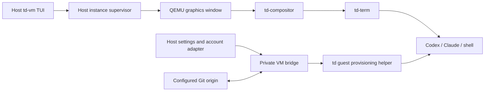

# td-vm: graphical development instances

## Status and scope

This is the replacement design for td-vm. It supersedes the unsubmitted
SSH/host-tmux prototype: the intended product is a host TUI for persistent
graphical td VMs. This document specifies work to implement; it does not
claim that the prototype or the stock demo image already provides it.

The main acceptance criterion is **create an instance, open its QEMU window,
and start working in td with the selected agent and existing host identity**.
Installing compilers, cloning the repository, configuring terminals, and
logging in separately on every image are not user setup steps.

The host is Linux x86-64 with a graphical session. KVM is preferred; QEMU TCG
software emulation is a supported fallback. The fallback changes performance,
not which td image boots or which development features are available.

## The daily flow

Running `td-vm` opens a table in the host terminal, using td-review's compact
keyboard-driven interaction style. Each row shows instance name, selected
repository/branch, template revision, VM state, accelerator, CPU/RAM allocation,
disk usage, and agent readiness. Details and failures appear below the table.
Escape sequences in names, guest messages, and logs are rendered as text.

| Action | Behavior |
| --- | --- |
| New | Choose name and Codex, Claude, or a development shell; use the configured repository, template, and resource defaults. |
| Open / Enter | Boot a stopped instance in its own QEMU graphics window. For a running instance, identify its existing window and focus it where the host permits; never launch a second QEMU on its disk. |
| Stop | Request an orderly guest shutdown and report completion. |
| Restart | Request an orderly guest reboot within the same QEMU process. |
| Delete | Show the exact instance and its persistent data, then remove it only when stopped. |
| Templates | Prepare/import a verified template, select the default, inspect references, or remove an unused template. |
| Host integration | Show settings compatibility and account-link status; synchronize settings or reconnect an expired account. |
| Logs | Inspect bounded boot/provisioning diagnostics without exposing credentials. |
| Quit | Close the manager; leave running QEMU windows and their supervisors alive. |

Equivalent noninteractive subcommands use the same operations. Instance creation
does not ask for an SSH identity, port, terminal emulator, or tmux session.

The guest owns terminal rendering, scrollback, input, and application launch.
td-vm does not relay terminal bytes or implement terminal multiplexing.

## QEMU and window lifetime

Use a native QEMU GTK or SDL window with td's canonical virtual GPU, input,
audio, boot kernel, selector, and deployment layout. Keep the display backend
in the host profile; its absence is a specific host dependency error, not a
reason to open a serial shell instead. Window titles include the instance name.

Automatic acceleration tries KVM, including its actual initialization, then
TCG if acceleration is unavailable. Use a CPU model supported by both modes
and sufficient for the image's compiled CPU baseline; `-cpu host` cannot be
carried blindly into TCG. Record the accelerator actually selected through
QMP. The table says `Software (TCG)` when appropriate. An explicit `--accel
tcg` is available for reproducible fallback tests; `--accel kvm` requests a
strict diagnostic instead of fallback. Disk, display, and boot errors are
reported as themselves, not retried as presumed KVM failures.

Closing the host TUI is independent of the VM. Native QEMU windows are not
detachable viewers: minimizing a window keeps it running. Configure
`window-close=off` on the supported GTK/SDL backends so the window-manager
close button cannot accidentally cut power; use Stop or the guest's shutdown
action. QEMU crashes or an explicit force-stop are unclean exits. Report them,
retain the disk, and let the next boot perform normal filesystem recovery.
No promise is made to reconstruct a live QEMU display after its process dies.
QEMU documents accelerator fallback and these display controls in its
[invocation reference](https://www.qemu.org/docs/master/system/invocation.html).

One small supervisor per running instance owns QEMU, QMP, and its guest bridge.
It survives TUI exit and has a private reconnectable control socket. Restarting
the TUI discovers these supervisors; it does not infer ownership from a process
name. A supervisor failure must not start a replacement guest until the
existing QEMU and disk lock are accounted for. Request orderly power actions
through the guest helper, which invokes td-svc's existing fixed power
operations. Force-stop is a distinct destructive action through QMP.

## Templates and isolated persistent state

A reusable template contains a verified td development deployment, not a
previous developer's machine. Build it locally from pinned recipes once and
reuse it. No maintainer-operated image server or binary cache is introduced.
Cold template preparation may require the full bootstrap build; show that as
template preparation, never hide it inside every New operation.

Import verifies the consumed kernel, selector, disk, and development manifest
against checksums and the deployment's existing trust chain. The manifest
records source revision, CLI versions, guest protocol version, and development
capabilities. Reject external qcow2 backing/data dependencies. Copy imported
bytes into manager-owned storage before publishing an immutable template.

Each instance has an independent qcow2 overlay, machine identity, home,
repository clone, Git metadata, build outputs, store/cache writes, runtime
sockets, and agent session history. Template identities and credentials must
be absent. Do not turn a used instance into a template by merely deleting a
few visible files: old disk extents can retain them. Template production starts
from clean recipe outputs and fresh state.

Retain the prototype's useful lifecycle properties: per-instance locks,
short catalog transactions, immutable referenced bases, atomic publication,
recoverable staging, read-only status queries, and refusal to delete a live
disk. Base preparation must not hold a global lock while compiling. Removing
one instance must not touch another instance or any host CLI home. Report both
virtual disk capacity and actual allocated space; refuse an allocation that
cannot satisfy the configured reserve. CPU, RAM, and storage bandwidth remain
host-wide finite resources even though build locks are isolated.

## A development image, not a demo needing setup

The image producer owns these requirements:

- Source-built Rust, Cargo, linker/compiler tools, td control-plane tools,
  Git, required build/test utilities, CA certificates, and declared offline
  dependency sources. A clean checkout must build its builder and run the
  repository's actual checks with no host executables entering the target.
- A private writable build store and caches backed by the instance disk.
  Keep the deployed root immutable. Use the builder's declared store-prefix
  and sandbox mechanisms; never redirect writes into the template or pretend
  that the deployed read-only `/td/store` is a writable build workspace.
  The image increment must pin and test the exact prefix/mount arrangement.
- td-compositor, td-term, matching terminfo, and an ordinary development-user
  session. The provisioner creates state through its fixed service operation;
  the UI must not depend on the current root/su escape hatch.
- Source-built Codex and the reviewed Claude application payload and runtime,
  with their working directories, configuration, credentials, and child tools
  reachable through their proper launch paths. Host CLI executables and host
  plugin binaries are not copied into the image.
- The tools required by DEVELOPMENT.md's review roster as well as its build
  gate. An unavailable reviewer remains an explicit missing capability; the
  design does not make reviewer waivers or host-side execution of guest builds
  the default workflow.

First boot creates a unique identity and a private clone at
`/home/tester/src/td`, installs the mapped settings, establishes the selected
account adapter, and opens the chosen agent in a fresh td-term window at that
checkout. Provisioning is idempotent and journaled by generation: retries do
not erase work, rerun a clone over a modified checkout, or reset CLI state.
Subsequent boots reuse that state and report any required migration.

Distinguish `Booting`, `Preparing workspace`, `Needs host attention`, and
`Ready`. A successful QEMU spawn or a visible desktop alone is not Ready.
In particular, toolchain checks and a provider-authentication probe must pass
before displaying an agent as ready. Probes do not submit prompts or paid
model requests merely to check login.

## Sharing settings without sharing mutable homes

Link each selected host CLI profile once. Honor its configured home/location
and credential backend rather than assuming every installation uses defaults.
Settings transfer is an explicit schema/version adapter, not a recursive mount
of `~/.codex`, `~/.claude`, or the host home.

Copy portable preferences, instructions, skills, and supported source-based
extensions into an instance-local configuration generation. Map the chosen host
repository path to the guest checkout. Reconstruct host-specific paths instead
of leaving references to `/home/test` or `/gnu/store` in guest configuration.
Preserve provider, organization, model, and permission intent. Do not silently
weaken sandbox settings, switch accounts, or replace subscription auth with a
billed API key.

Hooks, MCP commands, credential helpers, local sockets, and binary plugins need
an explicit supported guest mapping. Classify secret-bearing settings as
credentials even if they occur in TOML/JSON. Show unsupported entries and their
effect once in Host integration; required entries with no mapping prevent the
profile being called compatible. Never run a guest-supplied hook on the host.
The manager supplies no general host-command proxy.

Locks, databases, session transcripts, caches, and project trust records remain
private. New instances receive the selected settings generation automatically.
Synchronize settings explicitly for an existing instance, showing conflicts
with guest edits. Boot does not overwrite its changed settings, and guest
changes are not silently written back to the host profile.

## Login reuse and refresh ownership

The desired UX is automatic reuse of an already linked host identity for each
new VM. Credential linking is host-level setup, not image setup. An expired or
unsupported login produces one actionable host status with a supported renewal
flow; asking every guest to start its own browser login is not the solution.

**Do not clone refresh-token caches into concurrently running VMs.** Codex
supports a file cache under CODEX_HOME or an OS credential store, and documents
copying a cache to a remote machine. Its concurrent-use constraint matters:
the automation guidance restricts a refreshable cache to one machine or
serialized stream and warns that another consumer's rotation can invalidate
it. Copying the bytes into separate files does not remove that upstream race.
See [Codex authentication](https://developers.openai.com/codex/auth/) and
[refresh ownership](https://developers.openai.com/codex/auth/ci-cd-auth/).

The design therefore uses a host account adapter as the single refresh owner
and delivers only the provider material each guest actually needs. Guest
sessions, tool execution, and model traffic remain in td. This is a user-local
credential service tied to the managed VMs, not maintainer-run infrastructure
or an inference proxy. An adapter must coordinate with any continuing native
host CLI consumer through a verified provider mechanism. A td-vm-only file
lock does not coordinate an unrelated host CLI. If exclusive ownership cannot
be established, link a distinct managed host credential once rather than
claiming the existing cache is safe to fan out.

Provider integration has separate obligations:

| Provider/mode | Design and required proof |
| --- | --- |
| Codex subscription | Keep refresh ownership on the host; deliver account-bound access credentials to guest Codex through a supported external-auth path. Codex app-server documents an experimental external-token mode, but that does not establish support in the shipped interactive CLI. Prove that CLI path, or add a reviewed source-built adapter, before claiming this mode works. |
| Claude subscription | Prefer a reusable host-managed credential that the pinned CLI officially accepts. A `claude setup-token` credential is a candidate for one-time host linking; an ordinary cached access token is not equivalent to it. Prove expiry, restart/resume, account restrictions, and the guest launch interface. |
| Existing API-key profile | Deliver the selected existing key through the provider adapter, retaining the configured endpoint and billing mode. Never select this mode just because subscription forwarding is unfinished. |
| OS keyring or external helper | Use a reviewed host adapter for that backend. Never copy the keyring database, request all stored secrets, or assume a nonexportable credential can be extracted. |

Codex's [external-auth documentation](https://developers.openai.com/codex/app-server/)
is an integration lead, not evidence that a transparent CLI bridge exists.
Claude documents Linux credentials in its configured `.credentials.json` and
a separately generated setup token. Its environment-token mode retains the
token for the running session and requires replacement/restart on expiry;
rewriting a file cannot be assumed to update that process. See
[Claude authentication](https://code.claude.com/docs/en/authentication) and
[environment variables](https://code.claude.com/docs/en/env-vars).

This provider-compatibility spike is the first implementation step. Its output
must name the exact host/guest versions, supported login modes, refresh owner,
and behavior under concurrent use. Unsupported modes remain visibly incomplete.
Do not declare effortless login solved by startup-only copy tests or invent an
OAuth exchange unsupported by the provider. One-time host authorization may
still be necessary for a managed credential; no per-image repetition is planned.

## The host/guest bridge

Use a dedicated virtio-serial port per VM connected to its supervisor through
a private Unix socket. QMP is a separate host-only control socket. No SSH
daemon, host port-forward, shared writable filesystem, or tmux is needed for
management, credential delivery, or Git transport. Existing distro SSH tooling
is outside this design's removal scope.

The host binds identity to the socket/QEMU pair it launched, not to an instance
name supplied by the guest. A versioned, bounded protocol carries fixed requests
for provisioning/status, selected settings generations, selected provider
credentials, Git streams, and power operations. Separate streams and limits
keep a Git transfer from blocking credential renewal or shutdown. The detailed
protocol increment must specify framing, lengths, deadlines, backpressure,
generation checks, and reconnect behavior before exposing a parser.

On the guest, a fixed-purpose td-owned service provisions files and publishes
user/application-scoped endpoints. Credentials reach the intended CLI through
its declared launch/credential interface, using volatile storage or descriptors
where supported. A file backend requiring persistence needs an explicit
per-instance credential-storage decision. No credentials belong in a template,
repo, seed manifest, QEMU argv, serial log, or TUI output. Do not send them via
synthetic keystrokes or the clipboard. A required environment variable is set
only at the final CLI launch boundary, not on QEMU or the whole desktop.

A running guest receiving a bearer credential can use that identity. VM
isolation does not confine the provider account or protect it from guest root.
Unlink/delete stops further deliveries; it cannot revoke already issued bytes.
Provider revocation remains distinct, and disk deletion is not secure erasure.
This design grants no new claim of hardware sealing, attestation, or human
authentication; [td-login's threat model](../td-login/THREAT-MODEL.md) and
[td-secret's contract](../td-secret/DESIGN.md) retain their existing scope.

## Repository transfer and submission

Use a consistent Git bundle of the selected committed revision for initial
provisioning. Show the selected revision and any excluded host dirty work;
never silently treat a dirty host checkout as a reproducible template. Clone
without shared object alternates or hardlinks to writable host Git state.

For a host-local origin such as `/srv/git/td.git`, a guest Git remote helper
streams Git's protocol over the VM bridge. The host invokes upload-pack or
receive-pack against the one preconfigured repository using fixed argv and
bounded sessions. No guest-supplied path or command chooses a host repository
or executable. Enforce the existing branch-submission policy on the host side;
the guest cannot gain integrator authority to update main. This is a local
transport adapter, not a new network-accessible Git server.

Fetch and push remain normal Git operations from the independent guest clone.
The shared origin naturally serializes ref transactions; working-tree indexes,
build locks, stores, and check-host state belong to each VM. Credentials for
an already reachable network origin use a separately selected Git adapter;
provider login does not imply access to the host's entire SSH agent or keys.

## Working through td-term and td-compositor

Use the compositor's supported launcher/control path to open each agent in a
fresh td-term PTY. Claude retains its foreign-application marking and confinement;
make the development checkout, declared build tools, and selected credentials
available through that policy. Do not launch it outside td-jail to make the
first demo work. Codex keeps its source-built provenance and supported sandbox.
Claude's foreign runtime, including its shell, must not become a tool or
execution input to a source-built recipe. Prove that development commands
enter the td-built control plane and its declared build sandbox with the
correct tools; exposing the checkout alone does not establish that boundary.

This directly exercises the terminal's native rendering, input, resize,
scrollback, terminfo, and compositor focus behavior. Fix missing terminal
capabilities there instead of hiding them behind host terminal emulation.
[Compositor design](../td-compositor/DESIGN.md) owns those interfaces;
[APPLICATIONS.md](../APPLICATIONS.md) owns application launch, state, executable
inputs, and credential access. Amend their specific contracts in the relevant
implementation landings; this proposal does not relax them.

## Implementation sequence and acceptance

1. Prove the account adapters, especially concurrent subscription use and token
   refresh, with real pinned CLIs. Record the supported modes and any one-time
   host authorization required. Use synthetic credentials for parser tests.
2. Build the complete development template and fixed guest provisioner. Prove
   an independent clone can build, check, review, and submit through the intended
   Git transport; include both CLI launch paths and application confinement.
3. Replace the prototype's SSH/tmux execution and metadata atomically with the
   TUI, QEMU windows, supervisors, and bridge. Keep disk-lifecycle safeguards.
   Do not submit the old prototype as the implementation of this design. If
   prototype disks exist, provide an explicit preservation/import path; never
   delete guest work during a metadata migration.
4. Enable the daily workflow only after the complete user journey passes.

Required evidence includes:

- Two instances from one template simultaneously edit, build, and run ready
  with private Git/build/store/runtime state, then submit distinct branches.
- Both guest CLIs work inside td-term without installation or per-VM login;
  settings, permission intent, checkout, model, and provider identity agree.
- Concurrent credential use crosses expiry/refresh, host CLI activity, account
  change, host-adapter restart, guest reboot, and deletion of a sibling VM.
  A stale snapshot cannot overwrite the host's newer login state.
- KVM and forced TCG boot the same image. Missing and permission-denied KVM
  select TCG automatically; unrelated boot failures remain clear diagnostics.
- Keyboard input, paste, cursor movement, resize, focus, and interactive agent
  redraw are verified in the real QEMU desktop, not just a serial smoke test.
- TUI exit/restart preserves running windows; duplicate opens do not duplicate
  QEMU. Orderly stop/reboot preserves work; force-stop is visibly unclean.
- Failed provisioning retries safely; bad manifests, full disks, interrupted
  creation, stale process records, and busy disk deletion preserve other data.
- Templates and exported diagnostics contain no linked credentials or host
  private files. Guest requests cannot read arbitrary host paths, invoke host
  commands, modify another instance, or change the configured origin mapping.

Host lifecycle tests alone do not prove these guest behaviors. Keep the design
and implementation status explicit until this evidence exists.
