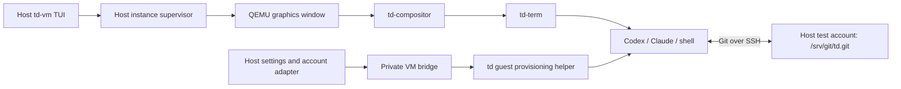
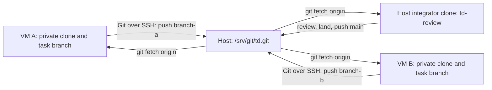

# td-vm: graphical development instances

## Status and scope

The first milestone is **import an existing clean td system image, create
independent persistent instances, and open their QEMU desktops from a TUI**.
Login reuse follows usable VM lifecycle, copy/paste, verified download reuse,
and the development/Git workflow. It is not a prerequisite for creating or
booting a VM.

The eventual acceptance criterion remains creating an instance and working in
td with the selected agent and linked host identity, without repeating image
setup or login. Capability status distinguishes that eventual workflow from
an ordinary running desktop.

### Implemented lifecycle increment

`td-vm` is a host binary in the dependency-free `td-review` crate. It imports
the existing `./build-qcow` bundle format, verifies and privately copies the
kernel, selector and disk, and creates one persistent qcow2 overlay per
instance. It does not execute the bundle's launcher. The TUI offers import,
create, open, template listing, bounded log-tail viewing, refresh, confirmed
force-stop, and confirmed deletion. Equivalent CLI commands are available.

```text
cargo build --release --manifest-path td-review/Cargo.toml --bin td-vm
td-review/target/release/td-vm import current /path/to/dist/td-vm-x86-64
td-review/target/release/td-vm create worker-a current
td-review/target/release/td-vm create worker-b current
td-review/target/release/td-vm
```

Import an unused bundle from the existing image producer; importing a running
or personalized disk is not template preparation. Import never builds the
image. If no bundle exists, `./build-qcow` prepares one once. Later create/open
operations reuse those bytes. `TD_VM_HOME` selects manager storage, defaulting
to `~/.local/share/td-vm`; keep that directory at its original absolute path
because overlays refer to their managed bases there.

Open defaults to GTK and automatic KVM/TCG selection. CLI options select
`--display sdl`, `--accel kvm` (strict), or `--accel tcg`. KVM initialization
failure falls through within QEMU's accelerator selection; unrelated errors
are not retried. A successful QMP query records the actual accelerator.
Existing windows are identified by their `td-vm: NAME` title; select one through
the host desktop when Open finds an existing QEMU process. Window focusing is
not implemented yet.

The table's `live` state means a QEMU process exists, including a guest paused
on a host disk I/O fault. `td-vm status NAME` or `h` in the TUI explicitly
queries QEMU execution and disk I/O status. Opening an existing instance also
shows that snapshot. Table refresh remains a local process/disk inspection;
it does not contact every monitor or claim that a live process is executing.
Status is read-only and does not create manager state. Monitor errors remain
unavailable status, never permission to start another QEMU or delete its disk.

`td-vm resume NAME` or `R` resumes `paused`, `io-error`, or `prelaunch` states.
Resolve the reported fault first: `nospace` means a host backing-disk allocation
failed, which is separate from free space inside the guest. Resume is explicit,
serialized with other instance operations, and checks QEMU execution again
after `cont`. An already running guest is unchanged; other execution states
are refused. A successful snapshot does not prove a disk fault cannot recur.
A paused VM retains its lifetime and disk locks throughout recovery. These
backend controls use QMP; guest clipboard, artifact and power integration keep
the td-owned protocol described below. See QEMU's
[run-state schema](https://github.com/qemu/qemu/blob/master/qapi/run-state.json)
and [block I/O schema](https://github.com/qemu/qemu/blob/master/qapi/block-core.json).

A separate supervisor waits for each QEMU independently of TUI exit. The TUI
reaps its completed supervisors through waiting threads. A slow template
verification remains visibly starting and continues in the background; it
does not turn a startup observation deadline into a failed launch. QEMU
inherits the supervisor's lifetime lock on its unused stdin descriptor, so a
supervisor exit cannot release that exclusion while QEMU lives. Operation
locks serialize changes to one instance, QEMU's own disk lock remains in
force, and a stopped disk must pass a writable lock probe before deletion.
Imports prepare under individual staging leases outside the short catalog
publication lock. Those leases are removed with their transient staging;
reusable instance/template lock inodes remain stable. Referenced templates cannot be removed. Read-only CLI
listing does not create manager state or take catalog locks.

This increment boots the stock desktop and reports workspace integration as
pending. Guest provisioning/unique guest identities, orderly host power
operations, private writable development stores, automatic
Git setup, and account linking are not implemented. The td-owned clipboard
and feed bridge described below requires a matching updated system image. Stop from the guest; host
`stop NAME --force` explicitly cuts power. Disk deletion requires `--yes` or
typing the instance name in the TUI and reports unsubmitted work as unknown.
The table reports allocated overlay space (`HOST MiB`) and virtual disk
capacity (`CAP MiB`), rounded down to whole MiB. Allocation excludes the shared
template and logs; capacity is the guest's block-device size, not filesystem
size or free space. Refresh reads the qcow2 header without contacting QMP or
taking a disk lock, so it also works while a VM runs. This read does not
validate qcow2 allocation tables. Invalid or truncated headers make that row
unavailable. The field layout follows the
[qcow2 format](https://www.qemu.org/docs/master/interop/qcow2.html).
Disk expansion, configurable free-space reserves, and on-disk log rotation
remain outstanding.
Log display reads bounded tails, but QEMU's retained serial log can grow.

The sections below specify the remaining complete workflow. Features described
there are not implied by the lifecycle increment's successful launch.

The host is Linux x86-64 with a graphical session. KVM is preferred; QEMU TCG
software emulation is a supported fallback. The fallback changes performance,
not which td image boots or which development features are available.

## The daily flow

Running `td-vm` opens a table in the host terminal, using td-review's compact
keyboard-driven interaction style. Each row shows instance name, selected
repository/branch, template revision, VM state, accelerator, CPU/RAM allocation,
disk usage, and agent readiness. Details and failures appear below the table.
Escape sequences in names, guest messages, and logs are rendered as text.

| Action | Behavior |
| --- | --- |
| New | Choose name and Codex, Claude, or a development shell; use the configured repository, template, and resource defaults. |
| Open / Enter | Boot a stopped instance in its own QEMU graphics window. For a running instance, identify its existing window and focus it where the host permits; never launch a second QEMU on its disk. |
| Stop | Request an orderly guest shutdown and report completion. |
| Restart | Request an orderly guest reboot within the same QEMU process. |
| Delete | Show the exact instance and its persistent data, then remove it only when stopped. |
| Templates | Prepare/import a verified template, select the default, inspect references, or remove an unused template. |
| Host integration | Show settings compatibility and account-link status; synchronize settings or reconnect an expired account. |
| Logs | Inspect bounded boot/provisioning diagnostics without exposing credentials. |
| Quit | Close the manager; leave running QEMU windows and their supervisors alive. |

Equivalent noninteractive subcommands use the same operations. Instance creation
does not ask for an SSH identity, port, terminal emulator, or tmux session.



The guest owns terminal rendering, scrollback, input, and application launch.
td-vm does not relay terminal bytes or implement terminal multiplexing.

## QEMU and window lifetime

Use a native QEMU GTK or SDL window with td's canonical virtual GPU, input,
audio, boot kernel, selector, and deployment layout. Keep the display backend
in the host profile; its absence is a specific host dependency error, not a
reason to open a serial shell instead. Window titles include the instance name.

Automatic acceleration tries KVM, including its actual initialization, then
TCG if acceleration is unavailable. Use a CPU model supported by both modes
and sufficient for the image's compiled CPU baseline; `-cpu host` cannot be
carried blindly into TCG. Record the accelerator actually selected through
QMP. The table says `Software (TCG)` when appropriate. An explicit `--accel
tcg` is available for reproducible fallback tests; `--accel kvm` requests a
strict diagnostic instead of fallback. Disk, display, and boot errors are
reported as themselves, not retried as presumed KVM failures.

Closing the host TUI is independent of the VM. Native QEMU windows are not
detachable viewers: minimizing a window keeps it running. Configure
`window-close=off` on the supported GTK/SDL backends so the window-manager
close button cannot accidentally cut power; use Stop or the guest's shutdown
action. QEMU crashes or an explicit force-stop are unclean exits. Report them,
retain the disk, and let the next boot perform normal filesystem recovery.
No promise is made to reconstruct a live QEMU display after its process dies.
QEMU documents accelerator fallback and these display controls in its
[invocation reference](https://www.qemu.org/docs/master/system/invocation.html).

One small supervisor per running instance owns QEMU, QMP, and its guest bridge.
It survives TUI exit and has a private reconnectable control socket. Restarting
the TUI discovers these supervisors; it does not infer ownership from a process
name. A supervisor failure must not start a replacement guest until the
existing QEMU and disk lock are accounted for. Request orderly power actions
through the guest helper, which invokes td-svc's existing fixed power
operations. Force-stop is a distinct destructive action through QMP.

## Templates and isolated persistent state

A reusable template starts from the existing clean `system-x86-64` deployment
and `./build-qcow` bundle. Reuse its kernel, selector, signed deployment, and
Btrfs/EROFS layout. Add missing development capabilities through that same
image producer, rather than introducing a second distro image pipeline. No
maintainer-operated image server or binary cache is introduced.
Cold template preparation may require the full bootstrap build; show that as
template preparation, never hide it inside every New operation.

Import verifies consumed files against bundle checksums; the existing boot
selector retains responsibility for deployment authentication. Checksums alone
do not authenticate an untrusted image. The stock bundle is a valid desktop
base without a development manifest. A later development-capability manifest
records source revision, CLI versions, guest protocol version, and development
capabilities; its absence prevents workspace/agent readiness, not desktop boot.
Reject external qcow2 backing/data dependencies. Copy imported
bytes into manager-owned storage before publishing an immutable template.

Each instance has an independent qcow2 overlay, machine identity, home,
repository clone, Git metadata, build outputs, store/cache writes, runtime
sockets, and agent session history. Template identities and credentials must
be absent. Do not turn a used instance into a template by merely deleting a
few visible files: old disk extents can retain them. Template production starts
from clean recipe outputs and fresh state.

The disk manager must provide per-instance locks,
short catalog transactions, immutable referenced bases, atomic publication,
recoverable staging, read-only status queries, and refusal to delete a live
disk. Base preparation must not hold a global lock while compiling. Removing
one instance must not touch another instance or any host CLI home. Report both
virtual disk capacity and actual allocated space; refuse an allocation that
cannot satisfy the configured reserve. CPU, RAM, and storage bandwidth remain
host-wide finite resources even though build locks are isolated.

## Add development capabilities to the existing image

Use one standard system image, including its source-built development tools;
there is no separate desktop/development profile. The common `./build-qcow`
producer prepares the template once, and instances reuse that immutable
base. Extend the existing system image where its capability checks identify
a gap. These are requirements for development readiness, not prerequisites
for the initial stock-desktop lifecycle increment. The image producer owns:

- Source-built Rust, Cargo, linker/compiler tools, td control-plane tools,
  Git, the source-built OpenSSH client and key generator, required build/test
  utilities, CA certificates, and declared offline dependency sources.
  A clean checkout must build its builder and run the
  repository's actual checks with no host executables entering the target.
- A private writable build store and caches backed by the instance disk.
  Keep the deployed root immutable. Use the builder's declared store-prefix
  and sandbox mechanisms; never redirect writes into the template or pretend
  that the deployed read-only `/td/store` is a writable build workspace.
  The image increment must pin and test the exact prefix/mount arrangement.
- td-compositor, td-term, matching terminfo, and an ordinary development-user
  session. The provisioner creates state through its fixed service operation;
  the UI must not depend on the current root/su escape hatch.
- Source-built Codex and the reviewed Claude application payload and runtime,
  with their working directories, configuration, credentials, and child tools
  reachable through their proper launch paths. Host CLI executables and host
  plugin binaries are not copied into the image.
- The tools required by DEVELOPMENT.md's review roster as well as its build
  gate. An unavailable reviewer remains an explicit missing capability; the
  design does not make reviewer waivers or host-side execution of guest builds
  the default workflow.

First boot creates a unique identity, provisions the private Git clone and
task worktree described below, installs the mapped settings, establishes the
selected account adapter, and opens the chosen agent in a fresh td-term window
at that worktree. Provisioning is idempotent and journaled by generation:
retries do not erase work, rerun a clone over a modified checkout, or reset CLI state.
Subsequent boots reuse that state and report any required migration.

Distinguish `Booting`, `Preparing workspace`, `Needs host attention`, and
`Ready`. A successful QEMU spawn or a visible desktop alone is not Ready.
In particular, toolchain checks and a provider-authentication probe must pass
before displaying an agent as ready. Probes do not submit prompts or paid
model requests merely to check login.

The native-toolchain increment packs source-built Rust/Cargo, GCC, binutils,
and the `td-cc` compiler defaults into that standard image. Its published
sparse volume is 10 GiB, allowing the boot/update fixtures to hold three
complete deployments with their debug companions. This is a deployment
capacity allowance, not a claim that a cold distribution build fits there.
Private development-store placement and VM data-capacity management remain
required before reporting the complete repository workflow ready. The standard
Rust toolchain also builds cargo-clippy and clippy-driver from its pinned
source release, with an offline clean/denied-lint/repaired recipe probe.
On a standard td system, the control-plane helper resolver selects the
installed `x86_64-unknown-linux-gnu` Rust standard library and native C linker.
It recognizes the exact `ID=td` system identity in `/etc/os-release`; this
selects build configuration and grants no artifact provenance or authority.
Missing or broken native tools fail provisioning instead of downloading a
musl target or replacement toolchain. Other hosts retain their musl helper
configuration.

The builder, evaluator, recipe test binaries, and network preparation helper
use the same selected target and static-link policy. Each placed helper still
must have no ELF interpreter, dynamic dependencies, or runtime search path;
GNU static linkage is not a claim that libc name resolution can never load
runtime modules. The standard td image provides that libc runtime. Compiler,
linker, wrapper settings, and Cargo flags are pinned at helper build sites.
The native network helper builds offline and frozen from the verified
`td-net` vendor directory prepared through td-feed. Both the prelude and
native compiler path require its completion record to match the current lock.
A missing, incomplete, or stale vendor is a preparation gap; use the installed
td-feed/VM artifact preparation path first. Cargo never fetches registry
packages to repair this gap. The completion record is a local preparation
record, not authentication or protection from another writer with the same
filesystem authority. Preparation copies the complete locked archive set into
private scratch, verifies each copy against Cargo.lock, and extracts the
packages into a separate Cargo directory source. Cargo receives that extracted
tree with package checksums, never td-feed's directory of `.crate` files.
The scratch remains private to the invocation and is removed after the build.
Evaluator preparation is Rust-owned; the existing script entry point delegates
to its memoized builder operation. Its source fingerprint covers that Rust
implementation as well as the script entry point. The helpers remain control
plane programs: compiling one inside td does not admit it as a target recipe
tool or replace the source-bootstrap artifact graph.

The native build sandboxes also accommodate the standard kernel's disabled
SysV IPC and POSIX message queues. They inspect only their freshly mounted
procfs before executing a workload. Available IPC facilities require a new,
verified IPC namespace; only verified absence permits omitting it. Errors
and exposed facilities without namespace support refuse the build. This
preserves the deployed kernel policy; it does not infer isolation from the
distribution identity or an inherited `/proc` view.

These helpers alone do not establish the complete repository workflow. Private
writable store placement, capacity, workspace provisioning, and a two-guest
full-check/Git round trip remain separate acceptance requirements.

The builder preserves inherited mount restrictions when making private-store
inputs read-only. Both host and derivation sandboxes use additive mount
attributes, so td's nosuid,nodev writable state can hold executable native
build inputs without weakening its mount policy. A successful IPC capability
check alone does not prove private-store preparation or a complete build.

## Copy/paste before account linking

Make ordinary text copy/paste work in both directions between the host desktop
and td-term in the selected QEMU window. Treat this as a first-class development
capability. The compositor has a focus-scoped Wayland clipboard; td-term
supports selection copy and bounded UTF-8 paste using Control+Shift+C/V,
including application-requested bracketed paste. The td-owned host/guest transport uses the private VM bridge below.

Use the existing compositor clipboard and terminal PTY input paths. Preserve
UTF-8, multiline text, selection ownership, and bracketed paste when the child
requests it. Pasting inserts text; it must not add an Enter key to run it.
Do not simulate characters with QMP keycodes or turn terminal escape sequences
into an implicit host clipboard-write interface. Initial support is text;
file drag/drop is a separate capability.

The compositor owns the guest protocol; QEMU only carries bytes on the standard
virtio-serial device. No QEMU guest agent, SPICE/vdagent protocol, QEMU clipboard
extension, or QEMU patch participates. Explicit actions in the host manager
select one instance. QEMU-window focus and clipboard shortcuts are not exposed
by this transport and are not claimed by this increment.

In the TUI, `v` opens a bracketed-paste prompt in the host terminal. Paste with
the host terminal's ordinary Paste action, then confirm the byte count and
instance. This replaces the guest selection; focus td-term and press
Control+Shift+V to insert it. No Enter is added. `c` fetches the selected guest's
text selection and makes one explicit OSC 52 write request to the host terminal.
That terminal must support and allow OSC 52 writes; the manager reports a
request, not confirmed host clipboard ownership. There is no OSC clipboard
query, watch, background synchronization, or terminal escape path originating
in a guest application. Unsupported terminals can use the byte-oriented CLI:

```text
td-vm clipboard put worker-a < text.txt
td-vm clipboard get worker-a > text.txt
td-vm sharing worker-a off
td-vm sharing worker-a on
```

The paste prompt has a two-minute deadline. Within that deadline, an oversized
or invalid framed paste is consumed through its end marker before returning to
the menu. Ctrl+C cancels while waiting for a frame; inside a frame it is invalid
text, so it cannot expose the remaining framed paste as menu keystrokes.
These framing guarantees require bracketed-paste support; unsupported
terminals use the stdin/stdout CLI.

An empty import is refused and preserves the guest selection. The source text
is UTF-8, at most 64 KiB, and permits only TAB, CR and LF among
control characters. Export refuses an empty result: an abandoned source endpoint
must not silently clear the host clipboard. Neither diagnostics nor metadata records retain clipboard
contents. Explicit sharing defaults on; `off` refuses later transfers and does
not erase selections already delivered. Lifecycle and user bridge operations
share the per-instance operation lock. No clipboard transfer retries itself
after failure: a lost acknowledgement can mean a completed action.

The guest binds a transfer to a single-use five-second snapshot of its current
ordinary keyboard focus, keyboard state and selection. A change invalidates the
snapshot, even if focus moves away and back. Secure attention and an unfocused
seat refuse clipboard snapshots. Applications still use the existing focused
Wayland data-device route; the host bridge is not an ordinary Wayland client
and adds no public client protocol. There are no unsolicited guest clipboard
messages or cross-instance relays, so there is no synchronization loop.

Test host-to-guest and guest-to-host text in the real desktop, including Unicode,
multiline paste, application-requested bracketed paste, switching between two
VM windows, replacing selections mid-transfer, and disabled sharing. No
credentials are required to demonstrate this milestone.

## Reuse verified downloads with private guest writes

Reuse the host's existing `td-feed` artifact cache. Guests fetch pinned bytes
from a host-local endpoint and verify them against their own committed recipe
pins and Cargo lock checksums. Keep guest stores, Cargo extraction/build state,
locks, and writable caches on each instance's disk. Serving immutable download
bytes does not make a shared writable filesystem part of the design.

The existing building blocks are `td-feed ensure-serve`, its verified artifact
store, and the `TD_FEED_BASE` fetch routing setting. With QEMU user networking,
provision a guest-reachable endpoint for the host feed, such as
`http://10.0.2.2:<port>` after testing the actual listener/network pairing. Do
not copy a host `127.0.0.1` URL unchanged into a guest. Keep the listener local
to the development host; no maintainer-operated cache or public server is
required. Feed endpoint discovery/restart is host profile state, not a baked-in
port in each image.

Run `td-feed ensure-serve` on the host to obtain its loopback port, then
`td-vm feed NAME PORT` (or `f` in the TUI). The manager records only
`http://10.0.2.2:PORT` and replays this idempotent configuration when the bridge
becomes available, including after a reboot in the same QEMU process. If the
guest does not acknowledge, the command reports the reason and returns failure;
the desired configuration remains saved for a later supervisor retry.
`td-vm feed NAME off` clears it. The compositor publishes the endpoint as
ordinary non-secret data in its volatile `/run/td-compositor/1000/vm-feed`.
`td-feed consume sources` uses that compositor-owned regular file when
`TD_FEED_BASE` is unset. An explicit environment value wins. This avoids
changing login environments or requiring a new terminal after configuration.
The explicit Cargo archive consumer described below uses the same endpoint.
Host producer warm commands do not implicitly adopt it.

The source archive consumer is `TD_FEED_BASE=http://HOST:PORT td-feed consume
sources`. It resolves the checkout's recipe source pins, reads verified host
bytes into the caller's private `~/.td/sources`, and refuses upstream fallback
and HTTP redirects. The endpoint requires an explicit HTTP(S) scheme and
one server authority, with no path, query, fragment, or credentials. Each
source transfer has a two-minute absolute deadline. Missing or mismatched
bytes fail with all affected pins and conditional host warming instructions;
local cache failures retain their own diagnostics. It does not populate a local producer store or start a
feed daemon. Valid private cached bytes remain usable while the host is down.
Source pin resolution needs the checkout's built `target/release/td-builder`
or an installed `td-builder` on PATH; `TD_BUILDER_SELF` may explicitly select
one. The command supplies that selection to the existing evaluator helper.
Like `warm sources`, it attempts local kernel-header preparation after the
archives are present; that best-effort preparation is not a readiness claim.

On the host, run `td-feed export sources` to publish the selected checkout's
already downloaded `~/.td/sources` archives into `~/.td/feed/store` (or
`TD_FEED_DIR/store`). It verifies each pin, copies through a bounded atomic
publication path, and writes the feed's integrity sidecar before releasing
the writer lock. Each archive must satisfy both the 16 GiB size ceiling
and two-minute deadline. A concurrent read during replacement can fail closed until
both files are published; retry the read. Export never downloads
or starts a daemon. Already verified feed entries need no local archive;
missing or corrupt archives are reported together. Run `td-feed ensure-serve`
to expose the result through the existing loopback server. This closes the
case where a warm private host cache had never populated its HTTP feed.

For Cargo registry archives, run `td-feed export cargo LOCK ARCHIVES` on the
host. `LOCK` is the selected Cargo.lock and `ARCHIVES` is an existing directory
of downloaded `NAME-VERSION.crate` files, such as
`.td-build-cache/crate-vendor/td-net/vendor`. Only the lock's registry packages
are exported; unrelated cached archives are ignored. Feed paths include the
package's locked checksum as well as name and version, so different checkouts or registries
can retain distinct bytes concurrently. No sparse index or registry access is
needed. Each object receives the same bounded copy, checksum verification,
atomic publication and integrity sidecar as recipe archives.

In the guest, `td-feed consume cargo LOCK ARCHIVES` reads that guest's own lock
and puts verified archives in its private destination directory. It uses
`TD_FEED_BASE` or the live compositor endpoint, refuses redirects and upstream
fallback, and reports every missing or mismatched package with its checksum.
A valid private archive remains usable with the host down. Both commands read
the lock once through a bounded regular-file descriptor and refuse a final
symlink. A file without generated package records is refused; a valid lock
with only local packages succeeds with zero registry transfers. The shared
`export sources` reader also refuses final archive symlinks and opens special
files without blocking before rejecting their type. Neither command starts a daemon or copies host Cargo configuration. They
report Git package counts explicitly and never attempt a Git transport.

The explicit `cargo LOCK ARCHIVES` commands transfer registry archives only.
They do not extract sources, remove unrelated destination files, or write a
`.warm-complete` marker. Use a private destination for each selected lock.

For automatic recipe selection and vendor preparation, use `td-feed export
vendors [TARGET]` on the host and `td-feed consume vendors [TARGET]` in the
guest. The default target is `system-x86-64`. Both use the checkout's existing
`td-recipe-eval vendor-warm-args` roster; an unplannable declared vendor fails
the roster instead of silently dropping that recipe. The same builder/evaluator
prerequisite as source-pin resolution applies. The current system closure
selects five jobs: uutils, ripgrep, fd, Codex, and td-net.

Export publishes the jobs' root source archives as well as their locked
registry archives. Source archives come from the existing source cache; a
packaged crate can also reuse its warm job's retained `work/NAME-VERSION.crate`.
It never warms missing inputs or fetches upstream. A local crate uses its own
lock, a fixed-output workspace uses its committed recipe lock, and a packaged
crate uses the lock shipped in its pinned archive, matching ordinary warming.

Consume stages a fresh private generated cache for each recipe. It reuses
verified private archives before contacting the host and obtains missing bytes
only from the selected feed. For a packaged crate, it retains the verified
original archive for repeat preparation and existing warm-tool probes. It reads
only bounded Cargo.lock and Cargo.toml members with td's native gzip and metadata readers. Preparation
requires no tar or gzip executable and creates no archive-supplied paths.
The compressed input is a no-follow regular-file read bounded to 64 MiB and
reverified against the source pin from the same bytes the decoder receives.
The shared gzip decoder checks CRC/length and limits expanded output to
256 MiB, 4,096 members and 1,048,576 DEFLATE blocks. Compressed and expanded
buffers coexist (up to 320 MiB of data), plus up to 17 MiB of selected text.
The tar metadata reader accepts ordinary GNU/USTAR regular-file and directory headers, including
USTAR prefixes, with at most 32,768 headers. It requires the GNU/USTAR magic
and a total length aligned to 512-byte blocks. It checks header checksums,
nonempty octal sizes, member bounds, zero member padding and both zero end
markers; links, GNU/PAX extension records, absolute/traversing paths and duplicate selected members are refused.
A future pin needing another header form requires extending this reader.
Cargo.lock and Cargo.toml must be UTF-8 and fit their respective 16 MiB and
1 MiB limits. The planner subprocess retains bounded output and a two-minute
deadline. The existing target-built build path authenticates and extracts its
source archive from the source cache; `consume sources` supplies that cache
separately.

Only a complete registry set with the selected lock digest receives the
`.warm-complete` marker. A changed local lock refuses publication. Preparation
keeps the previous generated cache until the complete staged directory can
replace it; retry restores a retained previous directory after interruption
or removes it after a successful replacement. A reader can briefly find the
current directory absent during replacement and should retry. Export, consume,
and ordinary Cargo warm jobs share a per-recipe preparation lock with a bounded
wait, so they do not overwrite one another's generated state. These operations
replace generated `.td-build-cache/crate-vendor/RECIPE` state, never the user's
source checkout. The builder's early td-net preparation uses the same
`warm crate-local` operation and canonical `RECIPE/vendor` layout; it no longer
writes a separate flat archive cache. Existing host caches need that ordinary
warm operation before export if they contain only the retired flat layout.
A published cache remains successful if old-backup cleanup fails: the command
warns and the next preparation retries cleanup. Repeated consume operations
reverify private archive bytes; a completion marker alone is not integrity
proof. Other recipes and other VMs keep independent state.

The vendor marker covers the registry subset; Git packages remain represented
by separately reviewed recipe source archives. Run `consume sources` as well
to acquire the source-pin table. Ordinary host `warm` commands retain their
producer behavior and can fetch upstream, including with `TD_FEED_BASE` set.
For the reviewed application/runtime graphs, use `td-feed export graphs` on
the host and `td-feed consume graphs` in each guest. Both resolve the entire
checkout's `td-recipe-eval ostree-pins` roster, currently Firefox and its
Freedesktop runtime. The same builder/evaluator prerequisite applies. Each
pin selects its existing private `~/.td/ostree/CACHE` directory. Export only
publishes a complete authenticated host graph; warm missing host graphs
through the ordinary recipe warm first. Neither transfer command fetches
upstream or starts a daemon.

Graph objects travel through the existing verified feed under a commit
namespace. The consumer retains the upstream pin as cache identity and uses
the host endpoint solely for transport. It authenticates every object against
its tree-reachable checksum, including decoding filez content, then checks the
pin's structural/decoded counts before publishing the complete private cache.
It refuses redirects, missing objects and mismatches without upstream
fallback. A verified existing private graph works with the feed stopped; a
failed replacement preserves the previous cache. The graph's existing size,
depth, worker and 12-hour acquisition limits apply, with a two-minute wait
for the same per-cache lock used by warming. Ordinary host warming retains
its blocking wait for another producer. The consumer refuses a memory-backed
HOME cache before graph acquisition. An interrupted export can leave verified
objects in the feed; retry completes it, and no partial guest graph is
published. The later materializer still reauthenticates objects and owns foreign-payload admission.

These commands do not claim a complete development image, private build-store
setup, or an upstream-disabled full system build. The stock image still needs
development toolchain and evaluator integration before checkout-based
preparation is a complete guest workflow.

Warm the selected repository revision's declared inputs on the host once.
Guests have read access to the resulting artifacts, not a general cache upload
or host-command API. For a missing pin, report what needs warming and permit
an explicit host warm of that declared input; do not claim zero downloads by
silently falling back upstream in each VM. Offline recipe steps remain offline;
provisioning/acquisition stages obtain and validate bytes before a build starts.
A guest cannot supply a URL/path pair that makes the host fetch arbitrary data.

The first acceptance test starts two fresh guest caches with host inputs warm,
disables guest upstream access, and proves both can acquire the selected
source/dependency closure without external downloads. Include corrupted cache
entries, missing pins, mismatched hashes, interrupted transfers, and host feed
restart. Corruption must fail verification rather than becoming a trusted
artifact because it came from the host.

Built-output reuse is separate from download reuse. The imported system image
already shares its immutable deployment bytes through overlays. Any additional
binary substitution must use td's existing provenance/closure contract and
retain foreign-payload marks; exposing the host's executable store as recipe
inputs is not an artifact-cache optimization. This milestone does not require
sharing mutable build databases or compiling everything anew for every VM.

## Sharing settings without sharing mutable homes

Link each selected host CLI profile once. Honor its configured home/location
and credential backend rather than assuming every installation uses defaults.
Settings transfer is an explicit schema/version adapter, not a recursive mount
of `~/.codex`, `~/.claude`, or the host home.

Copy portable preferences, instructions, skills, and supported source-based
extensions into an instance-local configuration generation. Map the chosen host
repository path to the guest's active task worktree. Reconstruct host-specific
paths instead of leaving references to `/home/test` or `/gnu/store` in guest configuration.
Preserve provider, organization, model, and permission intent. Do not silently
weaken sandbox settings, switch accounts, or replace subscription auth with a
billed API key.

Hooks, MCP commands, credential helpers, local sockets, and binary plugins need
an explicit supported guest mapping. Classify secret-bearing settings as
credentials even if they occur in TOML/JSON. Show unsupported entries and their
effect once in Host integration; required entries with no mapping prevent the
profile being called compatible. Never run a guest-supplied hook on the host.
The manager supplies no general host-command proxy.

Locks, databases, session transcripts, caches, and project trust records remain
private. New instances receive the selected settings generation automatically.
Synchronize settings explicitly for an existing instance, showing conflicts
with guest edits. Boot does not overwrite its changed settings, and guest
changes are not silently written back to the host profile.

## Login reuse and refresh ownership

The desired UX is automatic reuse of an already linked host identity for each
new VM. Credential linking is host-level setup, not image setup. An expired or
unsupported login produces one actionable host status with a supported renewal
flow; asking every guest to start its own browser login is not the solution.

**Do not clone refresh-token caches into concurrently running VMs.** Codex
supports a file cache under CODEX_HOME or an OS credential store, and documents
copying a cache to a remote machine. Its concurrent-use constraint matters:
the automation guidance restricts a refreshable cache to one machine or
serialized stream and warns that another consumer's rotation can invalidate
it. Copying the bytes into separate files does not remove that upstream race.
See [Codex authentication](https://developers.openai.com/codex/auth/) and
[refresh ownership](https://developers.openai.com/codex/auth/ci-cd-auth/).

The design therefore uses a host account adapter as the single refresh owner
and delivers only the provider material each guest actually needs. Guest
sessions, tool execution, and model traffic remain in td. This is a user-local
credential service tied to the managed VMs, not maintainer-run infrastructure
or an inference proxy. An adapter must coordinate with any continuing native
host CLI consumer through a verified provider mechanism. A td-vm-only file
lock does not coordinate an unrelated host CLI. If exclusive ownership cannot
be established, link a distinct managed host credential once rather than
claiming the existing cache is safe to fan out.

Provider integration has separate obligations:

| Provider/mode | Design and required proof |
| --- | --- |
| Codex subscription | Keep refresh ownership on the host; deliver account-bound access credentials to guest Codex through a supported external-auth path. Codex app-server documents an experimental external-token mode, but that does not establish support in the shipped interactive CLI. Prove that CLI path, or add a reviewed source-built adapter, before claiming this mode works. |
| Claude subscription | Prefer a reusable host-managed credential that the pinned CLI officially accepts. A `claude setup-token` credential is a candidate for one-time host linking; an ordinary cached access token is not equivalent to it. Prove expiry, restart/resume, account restrictions, and the guest launch interface. |
| Existing API-key profile | Deliver the selected existing key through the provider adapter, retaining the configured endpoint and billing mode. Never select this mode just because subscription forwarding is unfinished. |
| OS keyring or external helper | Use a reviewed host adapter for that backend. Never copy the keyring database, request all stored secrets, or assume a nonexportable credential can be extracted. |

Codex's [external-auth documentation](https://developers.openai.com/codex/app-server/)
is an integration lead, not evidence that a transparent CLI bridge exists.
Claude documents Linux credentials in its configured `.credentials.json` and
a separately generated setup token. Its environment-token mode retains the
token for the running session and requires replacement/restart on expiry;
rewriting a file cannot be assumed to update that process. See
[Claude authentication](https://code.claude.com/docs/en/authentication) and
[environment variables](https://code.claude.com/docs/en/env-vars).

This provider-compatibility spike follows the VM, clipboard, artifact, and
development workflow increments below. Its output
must name the exact host/guest versions, supported login modes, refresh owner,
and behavior under concurrent use. Unsupported modes remain visibly incomplete.
Do not declare effortless login solved by startup-only copy tests or invent an
OAuth exchange unsupported by the provider. One-time host authorization may
still be necessary for a managed credential; no per-image repetition is planned.

## The host/guest bridge

The initial bridge uses one named virtio-serial port, `org.td.vm.1`. QEMU
connects it to a private Unix socket inside the instance directory. A separate
supervisor control socket accepts local manager actions and serializes access
to that carrier. The carrier and QMP are separate sockets. Only the supervisor
speaks to the guest; restarting the TUI reconnects to the supervisor.

The standard image kernel builds `CONFIG_VIRTIO_CONSOLE=y`. At boot td-seatd
finds the exact port name through kernel sysfs, refuses duplicate names, and
assigns only that character device to compositor UID/GID with mode 0600. Its
private `vm-port` record tells the compositor which device it assigned. The
compositor opens that device using safe std nonblocking file I/O and starts a
bounded worker. Missing or invalid bridge devices do not prevent compositor
startup. Seat assignment removes a stale record when the named port is absent;
a changed assignment is refused before ownership of a replacement is granted.
Stock boots without this named device have no bridge. Hot
unplug does not authorize opening another device. A new bridge-capable bundle
comes from the existing `build-qcow` producer and can be imported once and
reused for every new instance; an older template still boots its desktop but
cannot acquire the new capabilities without an image update.

The implemented vocabulary is `snapshot`, `put`, `get`, `feed`, `ok`, `error`.
Each newline-terminated frame contains exactly six space-delimited fields:
`TDVM1 ID VERB REVISION LENGTH HEX_PAYLOAD`. Numbers are canonical unsigned decimal
u64, IDs are nonzero random host request identifiers, and payload hex is
lowercase with exactly LENGTH decoded bytes. Decoded payloads are at most 65,536 bytes; whole frames are at most
131,200 bytes. Empty payloads retain their final separating space. Unknown
versions, verbs, invalid numbers, odd/non-hex payloads, overflow and truncation
are refused. An expired or oversized partial frame is discarded through its
next newline. New carrier connections start with an empty delimiter to separate abandoned
bytes from new frames. Declared lengths reject truncated payloads. A complete
request whose final delimiter or acknowledgement was lost can still have
taken effect; the host never reports a timeout as proof of non-execution.

The host has one outstanding conversation per instance and an absolute
seven-second I/O deadline, covering the guest's five-second source deadline
plus relay time; a manager allows two more seconds for local queueing. Replies
echo the request ID. Clipboard operations first take a
snapshot and then consume it with the same ID and returned revision; the guest
checks it before mutation or source access and after a source read. A source
read retains at most 64 KiB and never holds the runtime lock during I/O. A
compositor-owned selection uses one writer with two queued endpoints and the
existing five-second clipboard write bound. Client selection replacements use
the ordinary cancellation and focused-offer paths. Transport errors are not
permission to replay clipboard actions; configuration retries are idempotent.
Idle loops back off to 100 ms. Saved feed configuration is replayed every two
seconds with a 500 ms budget, including an explicit `off`, so it survives a
guest reboot inside the same QEMU process. An unchanged guest file is not
rewritten. The initial protocol has no asynchronous guest-reboot notification.
The host does not accept unsolicited guest requests, paths, commands or URLs.

The bridge currently handles clipboard and feed configuration directly in the
compositor. Future provisioning, credentials, status and power operations need
separate fixed-purpose guest endpoints and their own reviewed authority; the
current worker does not implement them. Git uses ordinary outbound SSH to the
host; neither an SSH daemon in the guest nor a host-to-guest port-forward is
required. Interactive sessions use the QEMU window, with no shared writable
filesystem or tmux.

The host binds identity to the socket/QEMU pair it launched, not to an instance
name supplied by the guest. A versioned, bounded protocol carries fixed requests
for provisioning/status, selected settings generations, selected provider
credentials, Git public-key enrollment/branch reservations, and power operations.
Git objects and pack-protocol streams never travel over this bridge. Extensions must specify their own framing, lengths, deadlines, backpressure,
generation checks, and reconnect behavior before exposing new requests.

On the guest, a fixed-purpose td-owned service provisions files and publishes
user/application-scoped endpoints. Credentials reach the intended CLI through
its declared launch/credential interface, using volatile storage or descriptors
where supported. A file backend requiring persistence needs an explicit
per-instance credential-storage decision. No credentials belong in a template,
repo, seed manifest, QEMU argv, serial log, or TUI output. Do not send them via
synthetic keystrokes or the clipboard. A required environment variable is set
only at the final CLI launch boundary, not on QEMU or the whole desktop.

A running guest receiving a bearer credential can use that identity. VM
isolation does not confine the provider account or protect it from guest root.
Unlink/delete stops further deliveries; it cannot revoke already issued bytes.
Provider revocation remains distinct, and disk deletion is not secure erasure.
This design grants no new claim of hardware sealing, attestation, or human
authentication; [td-login's threat model](../td-login/THREAT-MODEL.md) and
[td-secret's contract](../td-secret/DESIGN.md) retain their existing scope.

## Git: guest clone, host origin, and td-review

### One shared bare origin, independent working copies

The host's existing bare repository is the submission point. For this repo,
the host profile selects `ssh://test@td-host/srv/git/td.git` as the guest's
origin URL. `td-host` is a provisioned SSH alias for the reachable host address
and port, not a required public DNS name. Both VM pushes and the integrator's
fetches reach the existing `/srv/git/td.git` bare repository. There is no second
per-VM remote that someone must export, synchronize, or discover before review.
The URL and its corresponding local repository are configured once on the host
and validated as an accessible bare Git repository with `main` as its default
branch. Opening td-vm from a host checkout can discover this local origin,
but must not silently create or
replace a repository when the configured origin is absent or inaccessible.

| Location | Repository and purpose |
| --- | --- |
| Host `/srv/git/td.git` | Shared bare origin: `refs/heads/main` and submitted topic branches. No working tree. |
| Each guest `/home/tester/src/td` | Full private clone, with `origin` addressing the host as `test` over SSH. |
| Each guest `/home/tester/src/work/<branch>` | Private task worktree on a descriptive branch, where the agent runs. |
| Host integrator checkout | Separate ordinary clone whose `origin` is `/srv/git/td.git`; td-review fetches and reviews its remote-tracking branches. |



Only Git objects and ref transactions cross the SSH connection. A guest does
not mount the bare repository, host checkout, or another guest's `.git` directory. Locks,
working-tree indexes, build caches, and check-host state stay within each VM.
The shared origin still takes Git's ordinary brief ref locks during pushes.

### Host accounts and authorized keys

`timmy` is the host operator running td-vm. `test` is the existing host account
used for Git SSH connections and access to `/srv/git/td.git`. Reuse that
account's repository ACLs; create no additional `git` account and do not
recursively change repository ownership. Check that files written through
SSH as `test` remain accessible to the integrator under the existing group/ACL
and umask policy. `timmy`'s local manager permissions and a VM's SSH permission
to act as `test` are different grants.
Codex/Claude settings and login reuse still come from `timmy`'s selected host
profiles. Selecting `test` for Git does not select `test`'s AI accounts.

The default authorized-key location is **`~test/.ssh/authorized_keys`**
(normally `/home/test/.ssh/authorized_keys`). It remains owned and managed
under `test`'s authority. Keep existing human/automation key entries unchanged;
only td-vm's registered VM entries carry the restrictions below. Do not apply
an account-wide forced command, disable `test`'s ordinary logins, or replace
its existing SSH configuration to implement this feature.

Each VM generates its own Ed25519 Git key on first boot. Its private half
stays in that instance's private persistent user state, mode 0600. Firstboot
sends only its public key through the instance-bound provisioning channel.
The host enrolls it for `test` and acknowledges enrollment before cloning.
Templates contain no Git private keys. Do not copy `timmy`'s or `test`'s personal
private key, or forward either user's SSH agent into guests.

Automated enrollment is a narrow host operation, not permission for `timmy`
or the guest to edit arbitrary files in `test`'s home. A local registrar runs
as `test`, accepts requests from the configured operator UID (`timmy`) over
an authenticated Unix socket, and manages only its own key records and branch
reservations. The manager associates guest public-key requests with its own
instance identity. The registrar accepts a validated public key and opaque
instance id, constructs the restrictions itself, and journals updates to its
records and authorized_keys while preserving unrelated entries. Publish each
file atomically; enable a key only when both records agree, and recover an
interrupted update without widening access. Reject
unexpected file metadata and conflicting edits rather than overwriting them.
Never accept caller-supplied authorized_keys options or a destination path.

One-time host integration installs/enables that registrar and establishes
`timmy`'s socket access under `test`'s authority. Existing ACLs may already
provide the necessary repository access; they do not automatically authorize
editing `test`'s SSH keys. This setup must complete before the profile is Ready,
so creating later instances needs neither per-VM sudo nor hand-edited keys.
The registrar and Git dispatcher are dependency-free host code; the registrar
is not a network service or a general command runner.

Each VM key receives OpenSSH's `restrict` option plus a fixed forced command
naming a trusted Git dispatcher and the registrar-assigned instance identity.
`restrict` disables PTYs, forwarding, and user rc execution; the forced command
restricts execution itself. The dispatcher validates SSH_ORIGINAL_COMMAND as
an allowed Git operation on this exact repository and invokes Git with fixed
argv and a sanitized environment. It never evaluates the supplied command
through a shell. Arbitrary commands, alternate paths, and SFTP are refused.
The identity comes from the authorized key's forced command, not a key comment
or client-supplied environment. See the
[OpenSSH authorized-key contract](https://man.openbsd.org/sshd.8).

Firstboot also installs the host's verified public host key in the guest's
known_hosts and an SSH profile selecting the instance key, `IdentitiesOnly`,
strict host-key checking, and no agent forwarding. Obtain that host key through
the trusted host setup/provisioning path, not an unauthenticated first network
connection. A host-key change requires updating the trusted profile. The SSH
address must work from QEMU's configured network; a LAN address can serve other
machines too. No inbound guest SSH listener is part of this arrangement.

Deleting or revoking an instance removes its enrolled key and stops accepting
new Git sessions. Track active sessions by registrar identity so explicit
revocation can terminate that instance's sessions too; removing a key alone
is not termination of an already authenticated connection. Posted Git branches
remain in the bare origin. Stopping and later booting a VM retains its key.

### First boot creates the clone automatically

The development image uses ordinary Git and its source-built OpenSSH client.
After key enrollment and host-key provisioning, the selected origin is ready
for an ordinary SSH clone. No custom Git remote helper is required.

On New, the manager selects a starting branch, normally `main`, records its
commit id, and reserves a unique descriptive task branch. The instance name
is the suggested branch name; the example below uses `terminal-scroll-fix`.
Use the normal branch naming rules in DEVELOPMENT.md, including reserving
`-rolling` for explicitly long-lived workstreams. The host retains the selected
commit for the duration of provisioning so concurrent origin updates or GC
cannot remove the source while the guest clones it.

Firstboot performs the equivalent of the following inside the guest. These
commands illustrate the provisioner's fixed argv operations, not manual setup
or a generated shell script:

```text
git clone --no-checkout --origin origin ssh://test@td-host/srv/git/td.git /home/tester/src/td
git -C /home/tester/src/td fetch origin
git -C /home/tester/src/td worktree add -b terminal-scroll-fix /home/tester/src/work/terminal-scroll-fix <selected-commit-id>
```

The clone contains the full history needed for merge-base, review, and rebase;
it is not shallow and uses no host object alternates or shared hardlinks.
Ensure `origin` has the normal fetch mapping
`+refs/heads/*:refs/remotes/origin/*` and set `origin/HEAD` to `origin/main`.
Verify the selected commit is present, retrieving its retained ref if origin
moved during provisioning. Record the resolved commit rather than checking out
whatever `main` happens to name later. Set the mapped Git author name/email and
open td-term at the task worktree. This completes before workspace readiness.

Clone directly over SSH. There is no separate initial-bundle transport or
bundle-backed `origin` to replace later. The image itself contains
no repository snapshot. Uncommitted host work is not cloned; show that exclusion
when selecting a source checkout. Continuing an existing host topic requires
its committed revision to be available in the configured origin and explicit
branch ownership transfer, rather than two active writers sharing a branch.

Retries use a private staging clone and publish it only after validation. A
failed clone can restart without replacing an existing workspace. Later boots
reuse the clone and worktree; they never reclone, reset, or silently rebase work.

### Normal guest Git commands reach the host

Git invokes SSH to connect as `test`; sshd authenticates the VM key and
executes its forced Git dispatcher. The dispatcher invokes only
`git-upload-pack` for clone/fetch or `git-receive-pack` for push against the
configured bare repository. SSH carries the standard full-duplex Git protocol.
Git retains responsibility for object transfer, negotiation, connectivity
checks, and ref updates. The local VM bridge is not on this data path.

The host-owned receive policy binds the authenticated instance identity to its
reserved branches, refusing updates to `main`, tags, other VMs' branches, and
internal retention refs. A trusted pre-receive check validates proposed ref
transactions before accepting a VM push; an SSH forced command alone does not
restrict branch updates. The dispatcher supplies that identity under host
control, and the guest cannot substitute environment or Git configuration to
bypass the policy. Preserve existing trusted repository hooks when integrating
this check. See [Git receive hooks](https://git-scm.com/docs/githooks).

A guest can read submitted topic branches for dependent work. Reserving
additional task branches is an atomic registrar operation that rejects
ownership conflicts. Guest push deletion is refused; branch cleanup remains
the integrator's job. Ordinary host access to the origin and the integrator's
separate credentials retain their existing authority to update main.

From the task worktree, the agent follows DEVELOPMENT.md: commit with the
required review record, run the real ready gate, then submit its branch:

```text
git fetch origin
target/release/td-builder ready
git push -u origin terminal-scroll-fix
```

A successful push creates or updates
`/srv/git/td.git`'s `refs/heads/terminal-scroll-fix`, preserving the exact commit
objects and review trailers. `origin` is the live host remote from the first
clone onward. There is no host-side file-copy or export step after a push.
An interrupted push is reconciled by fetching and comparing the remote tip;
do not infer rejection or success solely from a disconnected client.

Normal non-fast-forward conflicts require fetch and reconciliation. The
`--force-with-lease` workflow for rebased branches remains governed by
DEVELOPMENT.md and must be supported by the transport; the receive policy still
restricts which branch the VM can update. A push is not proof that guest tests
ran: ready and the durable review record remain the submission contract, and
the integrator performs its existing verification.

### Host review and the return path

The integrator uses its ordinary host checkout, already configured with this
bare origin. For a newly created integrator checkout, the one-time setup is
`git clone /srv/git/td.git /path/to/integrator`. Thereafter:

```text
git -C /path/to/integrator fetch --prune origin
td-review -C /path/to/integrator
```

Alternatively, `f` inside td-review fetches its base remote and refreshes the
table. The submitted branch appears as `origin/terminal-scroll-fix` under
`refs/remotes/origin/terminal-scroll-fix`; td-review reads the same commits and
review trailers the agent pushed. Its existing `r` replay and `p` publication
flow lands the work onto `main` and pushes it back to `/srv/git/td.git`. No
VM-specific discovery API, review inbox, namespace translation, or td-review
change is required. The guest then fetches `origin/main` through the same
SSH origin and follows the normal rebase or next-task workflow.

Stopping or deleting a VM does not delete any branch already pushed to the
host origin. Before deleting its disk, report commits and dirty files that
have not been submitted; a stopped guest's uninspected work is reported as
unknown, not as clean. Host branch retention and cleanup belong to td-review's
existing integrator workflow. Removing a landed ordinary branch releases its
name reservation; recreating it requires a new reservation. Rolling branches
retain their existing workflow semantics.

The host integrator may keep its local-path origin. Another development or
review machine can use an SSH URL reaching the same bare repository, with its
own enrolled key and role. An integrator using SSH needs a separately authorized
integrator key; a VM-restricted key cannot publish main. Codex/Claude account
credentials remain separate from these Git SSH keys.

## Working through td-term and td-compositor

Use the compositor's supported launcher/control path to open each agent in a
fresh td-term PTY. Claude retains its foreign-application marking and confinement;
make the development checkout, declared build tools, and selected credentials
available through that policy. Do not launch it outside td-jail to make the
first demo work. Codex keeps its source-built provenance and supported sandbox.
Claude's foreign runtime, including its shell, must not become a tool or
execution input to a source-built recipe. Prove that development commands
enter the td-built control plane and its declared build sandbox with the
correct tools; exposing the checkout alone does not establish that boundary.

This directly exercises the terminal's native rendering, input, resize,
scrollback, terminfo, and compositor focus behavior. Fix missing terminal
capabilities there instead of hiding them behind host terminal emulation.
[Compositor design](../td-compositor/DESIGN.md) owns those interfaces;
[APPLICATIONS.md](../APPLICATIONS.md) owns application launch, state, executable
inputs, and credential access. Amend their specific contracts in the relevant
implementation landings; this proposal does not relax them.

## Implementation sequence and acceptance

1. **Create/open from the existing image.** Import a clean existing bundle;
   implement the TUI, independent overlays, QEMU windows, KVM/TCG behavior,
   lifetime recovery, and safe deletion. Boot two desktops from the same base
   without image preparation on each create. Keep remaining capabilities
   visibly pending. The host lifecycle increment above starts this milestone.
2. **Make the desktop useful for development.** Implement td-term paste and the
   host/guest clipboard path, plus verified read-only reuse of host downloads.
   Prove two fresh guests consume warm artifacts without upstream downloads.
   These capabilities precede account linking.
3. **Complete the development workspace and Git round trip.** Extend the same
   image with missing development tools, private writable build state, and the
   fixed guest provisioner/power bridge. Enroll per-VM Git keys for host `test`,
   clone automatically, build/check in both guests, push distinct branches over
   SSH, review/land with host td-review, and fetch the resulting main back.
   Bring both CLI launch paths through their proper application confinement;
   authentication can remain explicitly unconfigured at this stage.
4. **Add settings and login reuse.** Prove the account adapters with real pinned
   CLIs, including concurrent subscription use and refresh ownership. Record
   supported modes and one-time host authorization. Then enable the complete
   agent-ready daily workflow. Synthetic credentials cover protocol tests;
   startup-only cache copying is not login-reuse acceptance.

Required evidence includes:

- Two instances from one template simultaneously edit, build, and run ready
  with private Git/build/store/runtime state, then submit distinct branches.
- Each first boot enrolls its own key for host user `test`, verifies the host
  key, clones over SSH, and opens its selected task worktree. Push over real
  SSH, fetch in a separate host integrator clone, and require td-review to list
  both branch tips with matching commit ids and review
  trailers. Land one through td-review, then fetch its new main in both guests.
  Cover clone interruption, a moving source ref, stale push leases, forbidden
  ref updates, and VM deletion preserving pushed branches. Verify that the
  `timmy` operator can enroll/revoke VM keys through the registrar while existing
  `test` login keys and repository ACLs remain intact. Require shell, forwarding,
  alternate-repository, forged-instance, and wrong-host-key refusals. Revoking
  one VM must leave sibling access and the integrator's main publication working.
- At the final account-linking milestone, both guest CLIs work inside td-term
  without installation or per-VM login;
  settings, permission intent, checkout, model, and provider identity agree.
- At the final account-linking milestone, concurrent credential use crosses
  expiry/refresh, host CLI activity, account
  change, host-adapter restart, guest reboot, and deletion of a sibling VM.
  A stale snapshot cannot overwrite the host's newer login state.
- KVM and forced TCG boot the same image. Missing and permission-denied KVM
  select TCG automatically; unrelated boot failures remain clear diagnostics.
- Keyboard input, paste, cursor movement, resize, focus, and interactive agent
  redraw are verified in the real QEMU desktop, not just a serial smoke test.
- TUI exit/restart preserves running windows; duplicate opens do not duplicate
  QEMU. Orderly stop/reboot preserves work; force-stop is visibly unclean.
- Failed provisioning retries safely; bad manifests, full disks, interrupted
  creation, stale process records, and busy disk deletion preserve other data.
- Templates and exported diagnostics contain no linked credentials or host
  private files. Guest requests cannot read arbitrary host paths, invoke host
  commands, modify another instance, or change the configured origin mapping.

Host lifecycle tests alone do not prove these guest behaviors. Keep the design
and implementation status explicit until this evidence exists.
